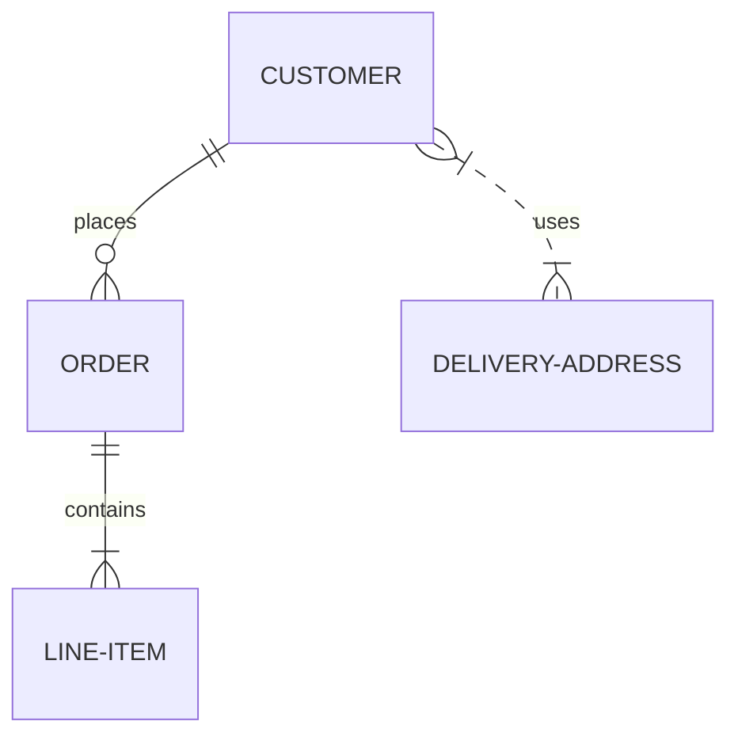

  


# **DHCP实现原理**

  

# **DHCP定义**

**DHCP**（Dynamic Host Configuration Protocol，动态主机配置协议）是一个局域网的网络协议，使用UDP协议工作。它是一种流行的Client/Server协议，一般用于为主机或者为路由器等指定相关的配置信息。DHCP服务在企业和家庭中得到了大量的应用，它能够自动分配ip地址以及一些其他的相关信息，整个过程对客户透明。

  

# **DHCP分配方式**

**自动分配方式**（Automatic Allocation），DHCP服务器为主机指定一个永久性的IP地址，一旦DHCP客户端第一次成功从DHCP服务器端租用到IP地址后，就可以永久性的使用该地址。

**动态分配方式**（Dynamic Allocation），DHCP服务器给主机指定一个具有时间限制的IP地址，时间到期或主机明确表示放弃该地址时，该地址可以被其他主机使用。

**手工分配方式**（Manual Allocation），客户端的IP地址是由网络管理员指定的，DHCP服务器只是将指定的IP地址告诉客户端主机。

  

# **DHCP工作过程**

DHCP客户机在启动时，会搜寻网络中是否存在DHCP服务器。如果找到，则给DHCP服务器发送一个请求。DHCP服务器接到请求后，为DHCP客户机选择TCP/IP配置的参数，并把这些参数发送给客户端。如果已配置冲突检测设置，则DHCP服务器在将租约中的地址提供给客户机之前会使用Ping测试作用域中每个可用地址的连通性。这可确保提供给客户的每个IP地址都没有被使用手动TCP/IP配置的另一台非DHCP计算机使用。

  

根据客户端是否第一次登录网络，DHCP的工作形式会有所不同。

  

# **初次登录**


  

初次登录时DHCP工作包括四个步骤

  

## **1、寻找DHCP服务器**

当DHCP客户端第一次登录网络的时候，计算机发现本机上没有任何IP地址设定，将以广播方式发送DHCP discover发现信息来寻找DHCP服务器，即向255.255.255.255发送特定的广播信息。网络上每一台安装了TCP/IP协议的主机都会接收这个广播信息，但只有DHCP服务器才会做出响应。

## **2、分配IP地址**

在网络中接收到DHCP discover发现信息的DHCP服务器就会做出响应，它从尚未分配的IP地址池中挑选一个分配给DHCP客户机，并向DHCP客户机发送一个包含分配的IP地址和其他设置的DHCP offer提供信息。

## **3、接受IP地址**

DHCP客户端接受到DHCP offer提供信息之后，选择第一个接收到的提供信息，然后以广播的方式回答一个DHCP request请求信息，该信息包含向它所选定的DHCP服务器请求IP地址的内容。

## **4、IP地址分配确认**

当DHCP服务器收到DHCP客户端回答的DHCP request请求信息之后，便向DHCP客户端发送一个包含它所提供的IP地址和其他设置的DHCP ack确认信息，告诉DHCP客户端可以使用它提供的IP地址。然后，DHCP客户机便将其TCP/IP协议与网卡绑定，另外，除了DHCP客户机选中的DHCP服务器外，其他的DHCP服务器将收回曾经提供的IP地址。

  
# **重新登录**

以后DHCP客户端每次重新登录网络时，就不需要再发送DHCP discover发现信息了，而是直接发送包含前一次所分配的IP地址的DHCP request请求信息。当DHCP服务器收到这一信息后，它会尝试让DHCP客户机继续使用原来的IP地址，并回答一个DHCP ack确认信息。如果此IP地址已无法再分配给原来的DHCP客户机使用时，则DHCP服务器给DHCP客户机回答一个DHCP nack否认信息。当原来的DHCP客户机收到此DHCP nack否认信息后，它就必须重新发送DHCP discover发现信息来请求新的IP地址。


1、如果客户端DHCP request 内的IP地址在服务器端没有被使用，DHCP服务器回复DHCP ACK继续使用IP。

2、如果客户端DHCP request 内的IP地址在服务器端已被使用，DHCP服务器回复DHCP NACK告诉客户端IP已被使用。

3、回复NACK后，重新开始DHCP初次登录时的流程

  

# **更新租约**

DHCP服务器向DHCP客户机出租的IP地址一般都有一个租借期限，期满后DHCP服务器便会收回出租的IP地址。如果DHCP客户机要延长其IP租约，则必须更新其IP租约。DHCP客户机启动时和IP租约期限到达租约的50%时，DHCP客户机都会自动向DHCP服务器发送更新其IP租约的信息。

  

  

  

# **在CentOS7上安装DHCP软件包**

  

```
[root@jhr-hub ~]# yum -y install dhcp


[root@jhr-hub ~]# cat /etc/dhcp/dhcpd
dhcpd6.conf  dhcpd.conf   
[root@jhr-hub ~]# cat /etc/dhcp/dhcpd.conf 
#
# DHCP Server Configuration file.
#   see /usr/share/doc/dhcp*/dhcpd.conf.example
#   see dhcpd.conf(5) man page
#
[root@jhr-hub ~]# 


[root@jhr-hub ~]# cp /usr/share/doc/dhcp-4.2.5/dhcpd.conf.example /etc/dhcp/dhcpd.conf
cp: overwrite ‘/etc/dhcp/dhcpd.conf’? y
[root@jhr-hub ~]#
```

  

# **修改DHCP的配置文件**

  

```
[root@jhr-hub ~]# vim /etc/dhcp/dhcpd.conf
[root@jhr-hub ~]# 
[root@jhr-hub ~]# 
[root@jhr-hub ~]# 
[root@jhr-hub ~]# cat /etc/dhcp/dhcpd.conf
# dhcpd.conf
#
# Sample configuration file for ISC dhcpd
#


# option definitions common to all supported networks...
option domain-name "example.org";
option domain-name-servers 3.7.191.1;


#设置当前的IP地址有效期，单位s
default-lease-time 60; 


#设置申请最大有效期
max-lease-time 60; 


# Use this to enble / disable dynamic dns updates globally.
#ddns-update-style none;


# If this DHCP server is the official DHCP server for the local
# network, the authoritative directive should be uncommented.
#authoritative;


# Use this to send dhcp log messages to a different log file (you also
# have to hack syslog.conf to complete the redirection).
log-facility local7;


# No service will be given on this subnet, but declaring it helps the 
# DHCP server to understand the network topology.


#声明IP地址段和子网掩码


subnet 192.168.1.0 netmask 255.255.255.0 {
    #地址池：设置一个地址段
   range 192.168.1.100 192.168.1.200;
   #指定网关
   option routers 3.7.191.1;
   #获取DNS         
   option domain-name-servers 192.168.1.1; 
}


# This is a very basic subnet declaration.


subnet 10.254.239.0 netmask 255.255.255.224 {
  range 10.254.239.10 10.254.239.20;
  option routers rtr-239-0-1.example.org, rtr-239-0-2.example.org;
}


# This declaration allows BOOTP clients to get dynamic addresses,
# which we don't really recommend.


subnet 10.254.239.32 netmask 255.255.255.224 {
  range dynamic-bootp 10.254.239.40 10.254.239.60;
  option broadcast-address 10.254.239.31;
  option routers rtr-239-32-1.example.org;
}


# A slightly different configuration for an internal subnet.
subnet 10.5.5.0 netmask 255.255.255.224 {
  range 10.5.5.26 10.5.5.30;
  option domain-name-servers ns1.internal.example.org;
  option domain-name "internal.example.org";
  option routers 10.5.5.1;
  option broadcast-address 10.5.5.31;
  default-lease-time 600;
  max-lease-time 7200;
}


# Hosts which require special configuration options can be listed in
# host statements.   If no address is specified, the address will be
# allocated dynamically (if possible), but the host-specific information
# will still come from the host declaration.


host passacaglia {
  hardware ethernet 0:0:c0:5d:bd:95;
  filename "vmunix.passacaglia";
  server-name "toccata.fugue.com";
}


# Fixed IP addresses can also be specified for hosts.   These addresses
# should not also be listed as being available for dynamic assignment.
# Hosts for which fixed IP addresses have been specified can boot using
# BOOTP or DHCP.   Hosts for which no fixed address is specified can only
# be booted with DHCP, unless there is an address range on the subnet
# to which a BOOTP client is connected which has the dynamic-bootp flag
# set.
host fantasia {
  hardware ethernet 08:00:07:26:c0:a5;
  fixed-address fantasia.fugue.com;
}


# You can declare a class of clients and then do address allocation
# based on that.   The example below shows a case where all clients
# in a certain class get addresses on the 10.17.224/24 subnet, and all
# other clients get addresses on the 10.0.29/24 subnet.


class "foo" {
  match if substring (option vendor-class-identifier, 0, 4) = "SUNW";
}


shared-network 224-29 {
  subnet 10.17.224.0 netmask 255.255.255.0 {
    option routers rtr-224.example.org;
  }
  subnet 10.0.29.0 netmask 255.255.255.0 {
    option routers rtr-29.example.org;
  }
  pool {
    allow members of "foo";
    range 10.17.224.10 10.17.224.250;
  }
  pool {
    deny members of "foo";
    range 10.0.29.10 10.0.29.230;
  }
}
[root@jhr-hub ~]#
```

  

# **启动服务**

  

```
[root@jhr-hub ~]# systemctl start dhcpd
[root@jhr-hub ~]# systemctl status dhcpd
● dhcpd.service - DHCPv4 Server Daemon
   Loaded: loaded (/usr/lib/systemd/system/dhcpd.service; disabled; vendor preset: disabled)
   Active: active (running) since Thu 2021-12-09 11:25:37 CST; 2s ago
     Docs: man:dhcpd(8)
           man:dhcpd.conf(5)
 Main PID: 142669 (dhcpd)
   Status: "Dispatching packets..."
   Memory: 5.0M
   CGroup: /system.slice/dhcpd.service
           └─142669 /usr/sbin/dhcpd -f -cf /etc/dhcp/dhcpd.conf -user dhcpd -group dhcpd --no-pid
```

> **关于**
>
> https://www.oiox.cn/
>
> https://www.oiox.cn/index.php/start-page.html
>
> **CSDN、GitHub、51CTO、知乎、开源中国、思否、掘金、简书、华为云、阿里云、腾讯云、哔哩哔哩、今日头条、新浪微博、个人博客**
>
> **全网可搜《小陈运维》**
>
> **文章主要发布于微信公众号**